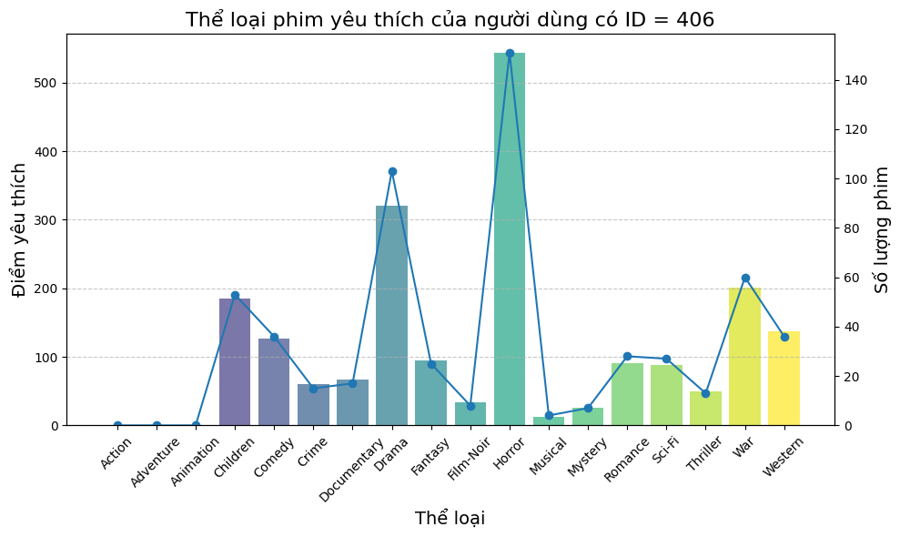
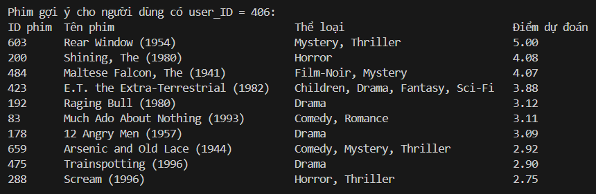

# PHƯƠNG PHÁP NHÂN TỬ HÓA MA TRẬN KHÔNG ÂM (NMF) VÀ ỨNG DỤNG

## Phát biểu bài toán NMF
Cho ma trận dữ liệu $\mathbf{A} \in \mathbb{R}^{m \times n}$  với các phần tử không âm, tìm một phân rã sao cho:

$$\mathbf{A} \approx \mathbf{UV}$$

trong đó $\mathbf{U}$ và $\mathbf{V}$ là các ma trận không âm có kích thước lần lượt là $m \times r$ và $r \times n$ với với $r$ là số nguyên dương thỏa mãn $r < \min(m, n)$.

## Thuật toán
Một trong những thuật toán phổ biến nhất để giải bài toán NMF là quy tắc cập nhật nhân ([Multiplicative Update Rules](https://www.researchgate.net/publication/2538030_Algorithms_for_Non-negative_Matrix_Factorization) - MUR) được đưa ra bởi Lee và Seung vào năm 1999 và 2001:

**Bước 1.** Khởi tạo hai ma trận không âm ban đầu là $\mathbf{U}^{(0)}$ và $\mathbf{V}^{(0)}$. Gán $k := 0$ 

**Bước 2.**  
- Cập nhật $\mathbf{U}, \mathbf{V}$ bằng công thức:

    
$$\mathbf{U}^{(k+1)} = \mathbf{U}^{(k)} \circ \frac{\mathbf{A} \left(\mathbf{V}^{(k)}\right)^\top}{\mathbf{U}^{(k)} \mathbf{V}^{(k)} \left(\mathbf{V}^{(k)}\right)^\top}$$
$$\mathbf{V}^{(k+1)} = \mathbf{V}^{(k)} \circ \frac{\left(\mathbf{U}^{(k+1)}\right)^\top \mathbf{A}}{ \left(\mathbf{U}^{(k+1)}\right)^\top \mathbf{U}^{(k+1)} \mathbf{V}^{(k)}}$$

- Gán $k := k + 1$ 

**Bước 3.** Lặp lại Bước 2 cho đến khi đạt điều kiện dừng.

## Ứng dụng của NMF trên bộ cơ sở dữ liệu [MovieLens 100K](https://grouplens.org/datasets/movielens/100k/) 
- Bộ cơ sở dữ liệu này bao gồm 100000 lượt đánh giá (1-5) từ 943 người dùng cho 1682 bộ phim:
    + *u.data*: chứa toàn bộ các đánh giá của 943 người dùng cho 1682 bộ phim.
    + *u.item*: chứa thông tin về 1682 bộ phim.
    + *u.user*: chứa thông tin về 943 người dùng.
      
- Gợi ý phim cho người dùng theo *user_ID*:
    + Xây dựng ma trận đánh giá $\mathbf{A}$: hàng đại diện cho người dùng, cột đại diện cho phim và các giá trị là điểm đánh giá (1-5 hoặc 0 nếu người dùng không đánh giá hay chưa xem phim) => ma trận $\mathbf{A}$ có kích thước $943 \times 1682$.
    + Xây dựng mô hình NMF dựa trên Thuật toán MUR: tách ma trận $\mathbf{A}$ thành 2 ma trận $\mathbf{U}$ và $\mathbf{V}$ có kích thước lần lượt là $943 \times r$ và $r \times 1682$ với *r* là số lượng thành phần tiềm ẩn (đặc trưng) của các bộ phim.
    + Đánh giá mô hình tìm *r* tối ưu.
    + Tìm thể loại yêu thích của người dùng *user_ID* dựa trên điểm đánh giá các bộ phim mà người đó đã xem.
    + Sử dụng mô hình NMF để dự đoán điểm đánh giá cho các bộ phim mà người dùng *user_ID* chưa xem: các giá trị trong ma trận $\mathbf{UV}$ là các điểm đánh giá dự đoán cho các bộ phim mà người dùng đó chưa đánh giá.  
  => Đưa ra danh sách 10 bộ phim mà người dùng có khả năng thích dựa trên các điểm đánh giá đã được dự đoán. Nhận xét: các bộ phim gợi ý có phù hợp với thể loại yêu thích của người đó hay không?

## Kết quả

    
Người dùng *user_ID = 406* có sở thích rõ ràng đối với thể loại phim kinh dị (Horror) và tâm lý (Drama), thể hiện qua số điểm cao và nhiều phim đã xem. Họ cũng có sự yêu thích nhất định với phim chiến tranh (War) và trẻ em (Children). Việc không có điểm đánh giá cho các thể loại như hành động (Action), phiêu lưu (Adventure) và hoạt hình (Animation) có thể cho thấy họ không quan tâm tới những thể loại này hoặc chưa có cơ hội xem.

