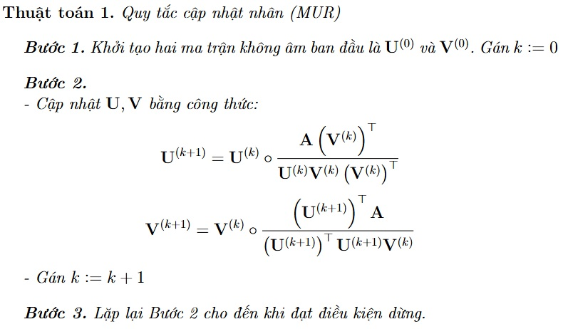

# PHƯƠNG PHÁP NHÂN TỬ HÓA MA TRẬN KHÔNG ÂM (NMF) VÀ ỨNG DỤNG
Một trong những thuật toán phổ biến nhất để giải bài toán NMF là quy tắc cập nhật nhân ([Multiplicative Update Rules](https://www.researchgate.net/publication/2538030_Algorithms_for_Non-negative_Matrix_Factorization) - MUR) được đưa ra bởi Lee và Seung vào năm 1999 và 2001.

Ứng dụng của NMF trên bộ cơ sở dữ liệu [MovieLens 100K](https://grouplens.org/datasets/movielens/100k/)
